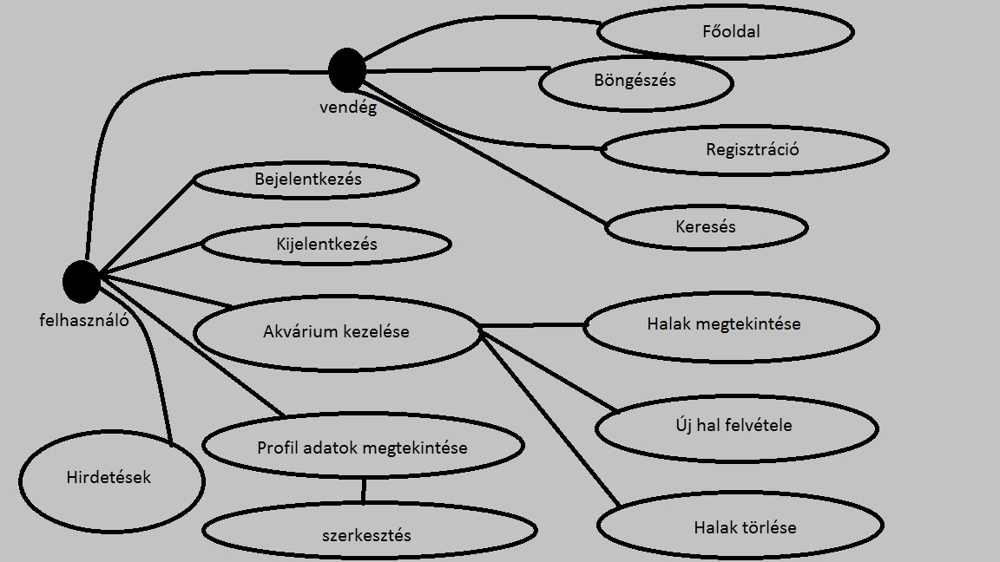
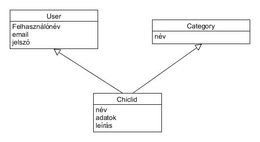
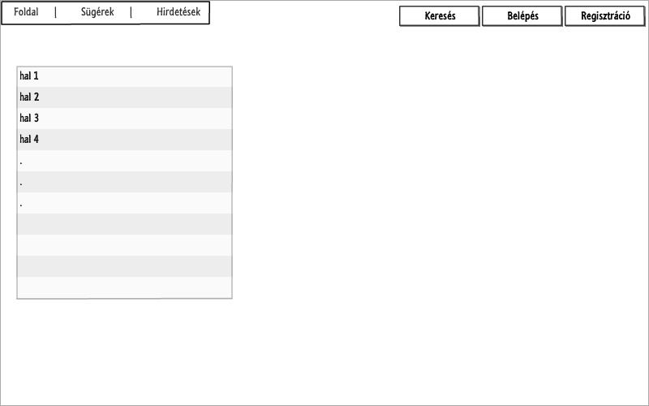
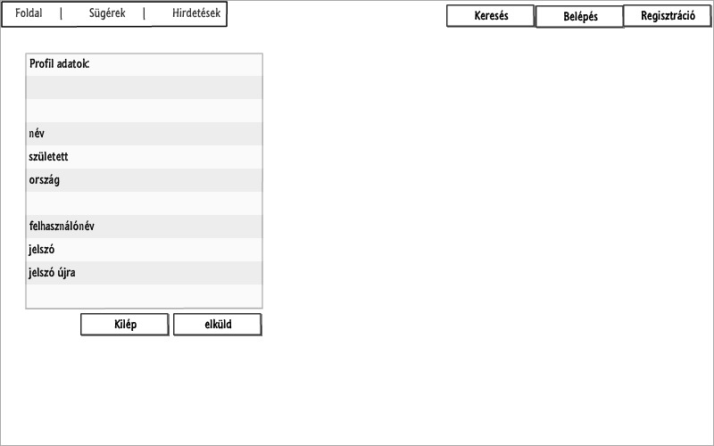
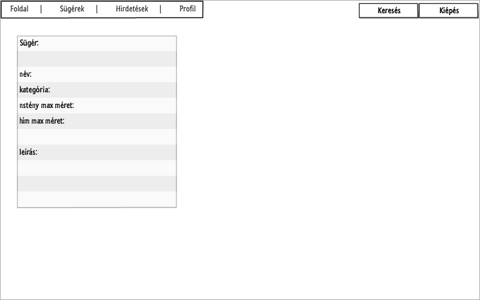
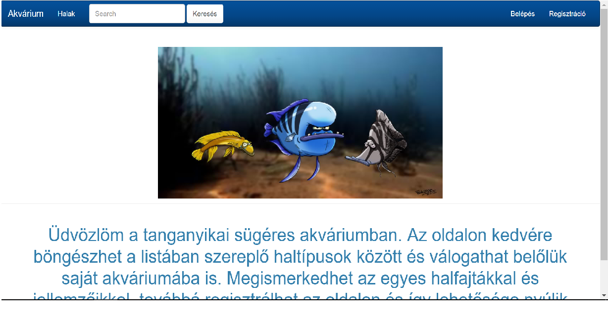
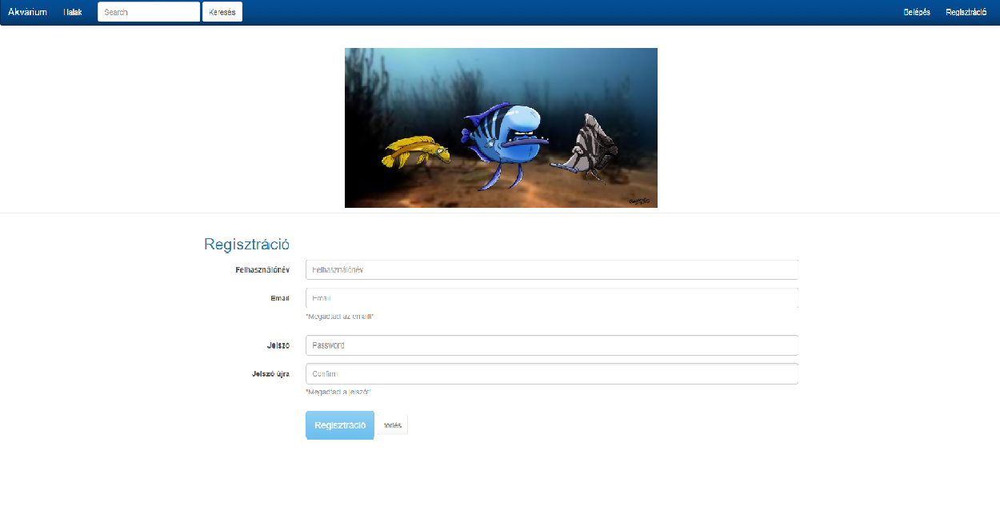
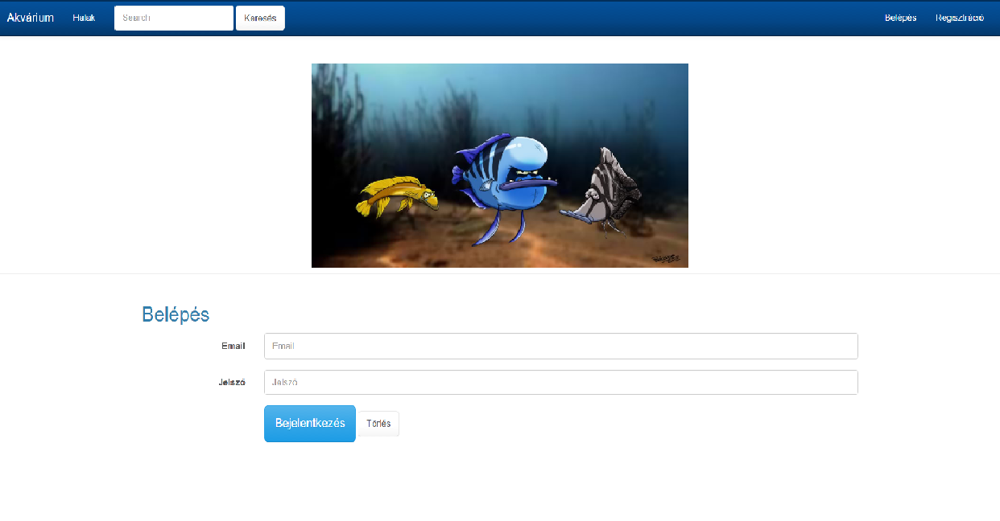

**Tanganyika sügéres akvárium**

Készítette: Bereczki Norbert

### **1. Követelményanalízis**

##### **1.1. Célkitűzés, projektindító dokumentum**

A program célja, átfogóbb ismereteket adni a Tanganyika-tóban őshonos sügérek, mint díszállatok tartásáról egyoldali alkalmazás felhasználásával.  Lehetőség legyen böngészni, ill. ismerkedni az egyes típusokkal, fajtákkal, továbbá akváriumi tartásukról minimális információkat szerezni. Vendégként böngészni, regisztrálni, felhasználóként pedig bejelentkezni, hirdetést feladni, akváriumot összeállítani és vezetni az ismert halfajtákból.

###### **Funkcionális követelmények:**

- Regisztráció
- Bejelentkezés
- Csak vendégként elérhető funkciók
  - az ismert, listában szereplő halakkal való ismerkedés
  - keresés a listából
  - hirdetések böngészése
- Csak bejelentkezett felhasználók által elérhető (plusz) funkciók
  - saját akvárium létrehozása (benne az ismert sügérek összeválogatásával)
  - meglévő akvárium szerkesztése
  - meglévő akvárium törlésére
  - hirdetés kiírása/szerkesztése

###### **Nem funkcionális követelmények:**

- Hibás adat esetén jelzés, jól bevitt adatok maradjanak az űrlapban. A funkciók jelszóval védettek, és a jelszavak védelme a háttérben.
- Gyors működés
- Könnyű kezelhetőség/áttekintés, követhető elrendezés
- Bővíthetőség, fájlcsoportosítás

##### **1.2. Szakterületi fogalomjegyzék**

**Fajták: (táplálkozás ill. viselkedés –esetleg forma- alapján)**

- Algázók: Kis- és nagytestű, főleg algával, növényekkel, ill. növényi származékokkal táplálkoznak
- Csigasügérek: leginkább mindenevő halfajok csoportja, jellegzetességük, hogy üres csigaházakban élnek és szaporodnak
- Homoki sügérek: főleg mindenevők, jellemzően talajlakó sügérfajták
- Kis testű ikrázók: formailag és táplálkozásban változatok, általában 10 cm alatti egyéb sügérfélék
- Lazacsügérek: könnyen elkülöníthető, vegyes táplálkozású, formailag inkább egységes halfajok
- Ragadozók: formában, színekben, méretben változatos, húsevő tanganyikai sügérfajok

##### **1.3. Használatieset-modell, funkcionális követelmények**

**Vendég**  : Csak a publikus oldalakat éri el

- Főoldal
- Bejelentkezés
- Regisztráció
- Keresés
- Globális lista, ill. halak böngészése

**Bejelentkezett felhasználó**  : plusz funkciókhoz is hozzáférhet

- Új akvárium felvétele (halak hozzáadása lista formájában)
- Meglévő akvárium törlése
- Meglévő akvárium szerkesztése
- Új (esetleg nem ismert, ill. kimaradt) sügérfaj felvétele a központi listába: jó admin esetén nem jellemző
- Hirdetés feladása

Vegyünk példának egy egyszerű folyamatot:

**Meglévő akvárium szerkesztése:**

1. A felhasználó az oldalra érkezve, bejelentkezik vagy regisztrál
2. Regisztráció után megtekintheti a halait listázó oldalt, tehát a saját akváriumát ahol kiválaszthatja a szerkeszteni kívánt halat.
3. Megtekint, majd szerkeszt.
4. Szerkesztés oldalon felviszi az új adatokat
5. Beküldés gombra kattintva elmenti a változásokat

### **2. Tervezés**

##### **2.1. Architektúra terv**

###### **2.1.1. Adatmodell:**

###### **2.1.2. Oldaltérkép:**

**Publikus:**

- Főoldal
- Bejelentkezés
- Regisztráció
- Keresés

**Bejelentkezett:**

- Főoldal
- Új hal felvétele a saját akváriumba
- Listaoldal (vezetett akvárium és a benne lévő halakról)
  -
    - Törlés
    - Halak hozzáadása/törlése
    - Hozzászólás vagy hirdetés létrehozása/szerkesztése

###### **2.1.3. Végpontok**

- GET/: főoldal/welcome
- GET/login: bejelentkezés
- POST/login: bejelentkező adatok felküldése
- GET/register: regisztráció
- POST/register: regisztráció beküldése
- GET/logout: kijelentkezés
- GET/fishes: halak listázása a főoldalon
- GET/fishes/:id/ hal adatok
- GET/ownFishes: saját halak listázása a főoldalon
- GET/fish/create: új hal
- POST/fish/create: új hal adatainak felvitele
- GET/fishes/:id/edit hal adatok
- POST/fishes/:id/edit hal adatok szerkesztése
- GET/fishes/:id/delete hal törlése
- GET/ad: hirdetések oldal
- GET/ads/:id: egy hirdetés 
- GET/ownAds: saját hirdetések
- GET/ads/create: hirdetés létrehozása
- POST/ads/create: hirdetés adatainak felküldése
- GET/ads/:id/edit: hirdetés adatai
- POST/ads/:id/edit: hirdetés adatainak szerkesztése
- POST/ads/:id/delete: hirdetés törlése
- GET/search: keresés

##### **2.2. Felhasználói-felület modell**

###### **2.2.1.Oldalvázlatok:**

**Főoldal**

**Regisztrációs oldal**

**Sügér adatok**

###### **2.2.2.Oldalképek (néhány példa):**

**Főoldal**

**Regisztrációs oldal**

**Bejelentkezés oldal**

###3.	Implementáció

######3.1.1. Fejlesztőkörnyezet

Webes IDE: **ADONIS**

#####4.4.Tesztesetek
* User
  * Felhasználó létrehozása
  * Bejelentkezés
  * Új hal hozzáadása
  * Új hirdetés hozzáadása
  * Hal törlése

  
###5.	Felhasználói dokumentáció

**Futtatáshoz szükséges operációs rendszer:** Tetszőleges operációs rendszer

**A futtatáshoz szükséges hardver:** Operációs rendszerek szerint megadva

**Egyéb követelmények:** Internet böngésző telepítése, JavaScript ajánlott

**Program használata:**

1. Böngészőben nyissuk meg a főoldalt
2. Jobb felső sarokban kattintsunk a Belépés feliratra
3. Belépés/Regisztráció után hozzáférünk jogokhoz.
4. Új hal hozzáadása gombra kattintva tudunk új halakat felvenni a listába
5. Töltsük ki az űrlapot
6. Hibás adatok esetén az űrlap jelezni fogja a hibát
7. Hozzáadás gombra kattintva mentsük el az adatokat
8. A hal oldalán: Törlés gombra kattintva törölhetjük a halat
9. A hal oldalán: szerkeszt gombra kattintva a szerkesztés oldalra jutunk
10. Hirdetések esetén hasonlóan

###6.	Fejlesztői dokumentáció:

## A szerveroldali alkalmazás progresszív fejlesztése kliensoldali JavaScript segítségével

##  AJAX-os funkció:

* ajaxLogin:
	* AJAX-os bejelentkezés, létrehoz egy modális dialógusablakot, ahol meg lehet adni az emailt és a jelszót, a belépés gombra 	kattintva az /ajax/login oldalra küldi az űrlap tartalmát. Hibás adatok esetén kiírja, hogy sikertelen, a mégse gombra kattintva eltűnik a modális ablak.
	
* ajaxDelete:
	* AJAX-os törlés, egy modális ablakban megerősítést kér a felhasználótól, hogy biztosan törli-e az adott halat, az Igen gombra kattintva megtörténik a törlés és eltűnik a modális ablak, a mégse gombra kattintva eltűnik a modális ablak.
  
* ajaxDelete (2):
	* AJAX-os törlés, egy modális ablakban megerősítést kér a felhasználótól, hogy biztosan törli-e az adott hirdetést, az Igen gombra kattintva megtörténik a törlés és eltűnik a modális ablak, a mégse gombra kattintva eltűnik a modális ablak.

	
## Tesztelés

* Funkcionális tesztelés [Selenium IDE-vel](https://addons.mozilla.org/hu/firefox/addon/selenium-ide/)
* Először a plugint kell telepíteni majd a tesztesetek a File/Open Test Suite menüpontban tölthetőek be a test mappában lévő testsuite fájlból.
* Tesztesetek:
	* Bejelentkezéslogin fájl)
	* Regisztráció(register fájl)
	* Hal hozzáadása(addnewfish fájl)
	* Hal törlése(deletefish fájl)
  * Hirdetés hozzáadása(addnewad fájl)
